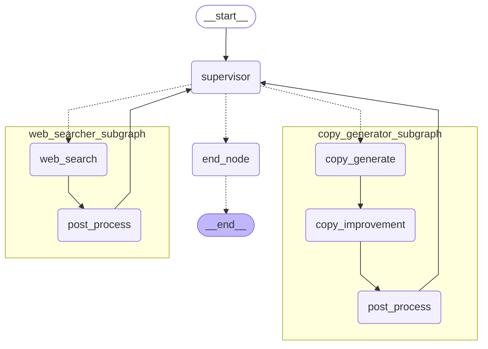

```mermaid
%%{init: {'flowchart': {'curve': 'linear'}}}%%
graph TD;
	__start__([<p>__start__</p>]):::first
	supervisor(supervisor)
	copy_generator_subgraph_copy_generate(copy_generate)
	copy_generator_subgraph_copy_improvement(copy_improvement)
	copy_generator_subgraph_post_process(post_process)
	web_searcher_subgraph_web_search(web_search)
	web_searcher_subgraph_post_process(post_process)
	end_node(end_node)
	__end__([<p>__end__</p>]):::last
	__start__ --> supervisor;
	copy_generator_subgraph_post_process --> supervisor;
	web_searcher_subgraph_post_process --> supervisor;
	supervisor -.-> copy_generator_subgraph_copy_generate;
	supervisor -.-> web_searcher_subgraph_web_search;
	supervisor -.-> end_node;
	end_node -.-> __end__;
	subgraph copy_generator_subgraph
	copy_generator_subgraph_copy_generate --> copy_generator_subgraph_copy_improvement;
	copy_generator_subgraph_copy_improvement --> copy_generator_subgraph_post_process;
	end
	subgraph web_searcher_subgraph
	web_searcher_subgraph_web_search --> web_searcher_subgraph_post_process;
	end
	classDef default fill:#f2f0ff,line-height:1.2
	classDef first fill-opacity:0
	classDef last fill:#bfb6fc
```